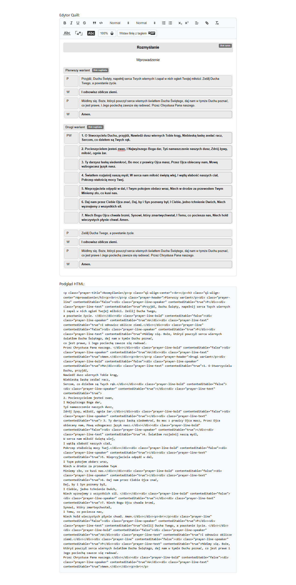
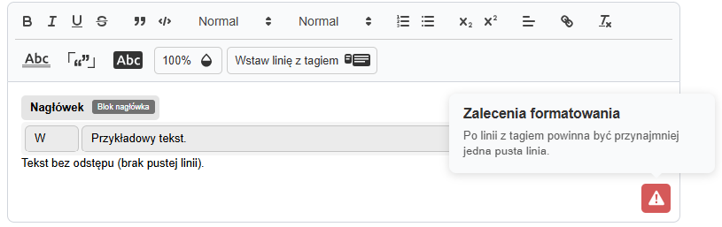

# Quill Prayer Editor

A specialized rich text editor built on top of Quill.js, designed specifically for creating and editing prayer texts with custom formatting blocks and enhanced visual elements.

## Features

- **Custom Prayer Blocks**: Specialized formatting blocks for prayer texts
  - Prayer Header: Styled header blocks with distinctive visual treatment
  - Prayer Title: Title blocks with decorative underlines
  - Prayer Quote: Formatted quote blocks with quotation marks
  - Prayer Opacity: Adjustable opacity levels (25%, 50%, 75%, 100%)
  - Prayer Line: Separator lines with customizable styles (normal, bold)

- **Enhanced Toolbar**: Custom toolbar with intuitive controls and SVG icons
- **Visual Labels**: CSS-based labels for better block identification
- **Modular Architecture**: Clean, maintainable code structure with separated concerns
- **TypeScript Support**: Full TypeScript implementation for type safety
- **Responsive Design**: Works seamlessly across different screen sizes
- **Formatting Validation**: Built-in validator checks for correct spacing and block usage, with actionable recommendations
- **Animated Warning Icon**: Validation issues are indicated by a gently shaking warning icon (triangle with exclamation mark)
- **Tooltip with Recommendations**: Hovering the icon shows a floating tooltip with formatting suggestions

## Installation

1. Clone the repository:
```bash
git clone <repository-url>
cd quill-editor
```

2. Install dependencies:
```bash
npm install
```

3. Start the development server:
```bash
npm run dev
```

## Usage

### Basic Implementation

```tsx
import React, { useState, useRef } from 'react';
import QuillPrayerEditor from './components/QuillPrayerEditor';
import type { QuillEditorRef } from './components/QuillPrayerEditor';

function App() {
  const [content, setContent] = useState("");
  const editorRef = useRef<QuillEditorRef>(null);

  return (
    <div>
      <QuillPrayerEditor 
        ref={editorRef} 
        value={content} 
        onChange={setContent} 
      />
    </div>
  );
}
```

**Example:**



### Custom Configuration

The editor comes with pre-configured prayer blocks and handlers. You can customize the toolbar and add additional functionality:

```tsx
// The editor automatically registers these custom formats:
// - prayer-header
// - prayer-title  
// - prayer-quote
// - prayer-opacity
// - prayer-line
// - prayer-line-bold
```

## Formatting Validation & Recommendations

The editor automatically validates the structure and formatting of prayer blocks. If issues are detected (e.g., missing spacing after a prayer line), a warning icon appears in the editor:

- The icon gently shakes to draw attention, but pauses when hovered.
- Hovering the icon displays a tooltip with actionable recommendations for improving formatting.
- Example issues detected:
  - Missing empty line after a prayer line block
  - Consecutive prayer lines without spacing

**Example:**



## Architecture

The project follows a modular architecture with clear separation of concerns:

```
src/components/quill-prayer/
├── blocks/                 # Custom Quill block definitions
│   ├── PrayerHeaderBlock.ts
│   ├── PrayerTitleBlock.ts
│   ├── PrayerQuoteBlock.ts
│   ├── PrayerOpacityBlock.ts
│   └── PrayerLineBlock.ts
├── modules/               # Core functionality modules
│   ├── handlers/          # Toolbar button handlers
│   ├── keyboard/          # Keyboard shortcuts
│   └── toolbar/           # Toolbar setup and state management
├── styles/                # CSS styles
│   └── prayer-editor.css
└── types/                 # TypeScript type definitions
```

### Key Components

- **PrayerBlocks**: Unified object containing all custom block definitions
- **PrayerHandlers**: Modular handlers for toolbar interactions
- **PrayerKeyboard**: Keyboard shortcuts and bindings
- **PrayerToolbar**: Toolbar initialization and state management

## Custom Blocks

### Prayer Header
Creates a distinctive header block with special styling:
```html
<div class="prayer-header">Header Content</div>
```

### Prayer Title
Adds a title block with decorative underlines:
```html
<div class="prayer-title">Title Content</div>
```

### Prayer Quote
Formatted quote blocks with quotation marks:
```html
<div class="prayer-quote">Quote Content</div>
```

### Prayer Opacity
Adjustable opacity levels for text:
```html
<div class="prayer-opacity prayer-opacity-75">75% opacity text</div>
```

### Prayer Line
Separator lines with customizable styles:
```html
<div class="prayer-line">Normal line</div>
<div class="prayer-line prayer-line-bold">Bold line</div>
```

## Development

### Project Structure

- `src/components/QuillPrayerEditor.tsx` - Main editor component
- `src/components/quill-prayer/` - Custom Quill extensions and modules
- `src/App.tsx` - Demo application
- `src/styles/` - Global styles

### Building

```bash
npm run build
```

### Type Checking

```bash
npm run type-check
```

### Linting

```bash
npm run lint
```

## Browser Support

- Chrome (latest)
- Firefox (latest)
- Safari (latest)
- Edge (latest)

## Contributing

1. Fork the repository
2. Create a feature branch
3. Make your changes
4. Add tests if applicable
5. Submit a pull request

## License

MIT License - see LICENSE file for details.

## Built With

- [React](https://reactjs.org/) - UI library
- [TypeScript](https://www.typescriptlang.org/) - Type-safe JavaScript
- [Quill.js](https://quilljs.com/) - Rich text editor foundation
- [Vite](https://vitejs.dev/) - Build tool and development server
- [Tailwind CSS](https://tailwindcss.com/) - Utility-first CSS framework
